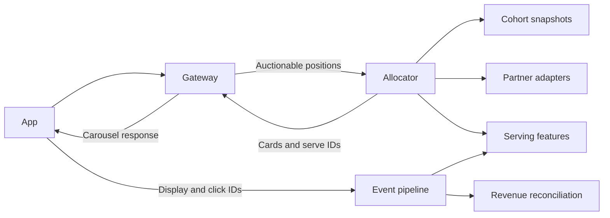
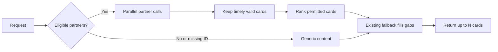

# A bounded allocator for contested carousel positions

## Scope

The gateway keeps internal, cached, reserved, and app-side SDK content on their current paths. It sends only auctionable real-time positions to the allocator, with their rules, item count, available advertising ID, and deadline. The allocator returns cards, serve IDs, and decision reasons.

This is the production proposal. The POC covers partner fetching and allocation only.

## Decision 1: finish within one deadline

Check eligibility and fetch matched partners concurrently. Apply partner timeouts inside one shorter request deadline based on measured app latency. Rank timely valid cards, cancel remaining calls, and use the existing fallback for gaps. A missing or unmatched advertising ID takes a generic path. Wait to cache personalised responses until identity, consent, and freshness rules are clear.

## Decision 2: make eligibility and revenue traceable

Treat each full cohort file as a replacement: validate it, build a versioned snapshot, and publish it as active. Define how long the last valid file may be used. Size the serving store before choosing Redis sets or another index.

For every returned card, record a serve ID, item, partner, position, cohort and config versions, and payable rate. The app reports display and clicks using that ID. Count duplicate clicks once and reconcile with partner settlement. Keep raw advertising IDs out of routine logs. Product and privacy owners decide any substitute identifier or partner sharing.

## Decision 3: rank by expected payable value

For card `i` in position `j`, compare `payable CPC(i) × P(click after return | i, j, context)`. Start with conservative partner and position priors, then blend sparse user history toward them. Prepare serving features offline; BigQuery stays off the request path. Use item-level payout when supplied and reject invalid rates. A commercial commitment may reserve a position, but an unrestricted override cannot silently win every auction.

Top N works when positions are interchangeable and cards do not change each other's click chances. Otherwise, choose the best valid assignment across positions. Calibrate estimates against linked return, display, and click events before using them as revenue weights.

## Proof and deferrals

Shadow the selector, then ramp traffic while comparing latency, fill, errors, clicks, and realised revenue with the current path. Keep rollback available. Defer Interest Model v2, a new portal, mediation platform, and personalised caching until the event contract and live evidence justify them.

The Go POC requests N cards from three mock partners with different latency, failure, and payout. It measures response time, fill, and assumed value against fixed order and CPC-only ranking. It shows how the policy behaves; real click estimates and the production deadline still need live data.
